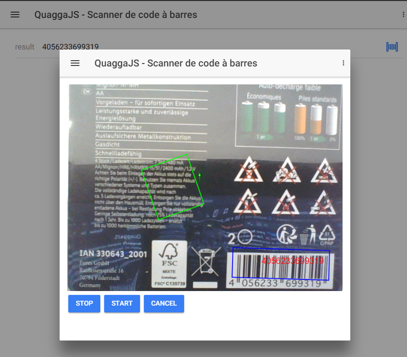

# **lib_ExtendedComponents**

Set of shared components you can use in your projects:
    
 - agGrid : Display & Edit tabular data
 - ngxTagInput : Display / remove Chips tags in input fields
 - angularxQRCode : QR Code component/module library to generate QR Codes (Quick Response)
 - QuaggaJS : QuaggaJS is a barcode-scanner entirely written in JavaScript supporting real- time localization and decoding of various types of barcodes.

SharedComponent can be dropped (CTRL + mouse click) in Mobile Builder page components to make use of it.

## **agGrid**

The **agGrid** SharedComponent is based on **ag-grid-community** and **ag-grid-angular** NPM packages.\
Visit [Angular Grid](https://www.ag-grid.com/angular-grid/) for documentation and usage.\
See it in action in **testAgGrid1** and **testAgGrid2** Mobile Builder pages.

## **ngxTagInput**

The **ngxTagInput** SharedComponent is based on **ngx-chips** NPM package.\
Visit [Tag Input Component](https://github.com/Gbuomprisco/ngx-chips/#readme) for documentation and usage.\
See it in action in **testNgxInput** and **testNgxInput1** Mobile Builder pages.

## **angularxQRCode**

**angularxQRCode** shared component is base on **angularx-qrcode** package version 1.6.4\
**angularx-qrcode** is a Ionic 3 and Angular4+ QR Code component/module library to generate QR Codes (Quick Response) in your Ionic and Angular 4+ app with support for AOT. It is a drop-in replacement for the no-longer-maintained angular2 component ng2-qrcode and based on qrcodejs.

### **Parameters**

| Attribute        | Type           | Default | Description  |
| ------------- |-------------| -----|------------|
| allowEmptyString      | Boolean | false     | Allow empty string |
| colorlight      | String | '#ffffff'     | Dark color |
| colordark      | String | '#000000'     | Light Color |
| level | String | 'M'    | QR Correction level ('L', 'M', 'Q', 'H') |
| qrdata      | String | '' | String to encode |
| size      | Number | 256     | Height / Width (any value) |
| usesvg      | Boolean | false     | SVG Output |

## **QuaggaJS**

**QuaggaJS** shared component is based on **Quagga** package version 0.12.1
**QuaggaJS** is a barcode-scanner entirely written in JavaScript supporting real- time localization and decoding of various types of barcodes.\
Visit [QuaggaJS](https://serratus.github.io/quaggaJS/) for documentation and usage.\
SharedComponent can be dropped (CTRL + mouse drag) in Mobile Builder page components to make use of it.\
Currently, it only supports "LiveStream" output type.\

### **Parameters**

| Attribute        | Type           | Default | Description  |
| ------------- |-------------| -----|------------|
| autoStart      | Boolean | true     | Automatically start scanning process |
| autoStop      | Boolean | true     | Automatically stop scanning process when code detected |
| drawResultType      | String | 'line'     | Can be 'line', 'text' or 'none'. Representation of the decoded code |
| colorProcessed | String | '#0F0'    | Html Hex color of the rectangle border while scanning bar code |
| colorDetected | String | '#00F'    | Html Hex color of the rectangle border when bar code detected |
| colorResult | String | '#F00'    | Html Hex Color of the 'drawResultType' variable |
| decoders      | String | 'all' | Decoders format. See QuaggaJS documentation for possible values |
| frequency      | Number | 10     | Defines the maximum number of scans per second |
| type      | String | 'LiveStream' | Stream format. Only supports 'LiveStream' (camera) |
| width      | Number/String | 640     | Media video width. Can be set to 'auto' to be responsive and take 100% wide |
| height      | Number | 480     | Media video height |

### **Input events**

**QuaggaJS** shared component subscribes to the following topics you can trigger using a **PublishEvent** component:

 - quagga:start (if **autoStart** is set to *false* you can manually start decoding process)
 - quagga:stop (if **autoStop** is set to *false* you can manually stop decoding process)
### **Output events**

**QuaggaJS** shared component publishes the following topics you can capture using a **Subscribe Handler** component:

 - quagga:stop (if **autoStop** is set to *true*, topic is triggered when quagga:ondetected process is finished)
 - quagga:onprocessed (called for each frame after the processing is done. The **out** object contains detailed information about the success/failure of the operation)
 - quagga:ondetected (triggered whenever a barcode-pattern has been located and decoded successfully; **out** object contains information about the decoding process including the detected code)

