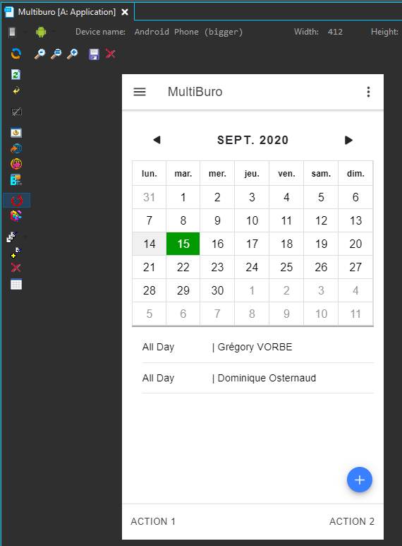
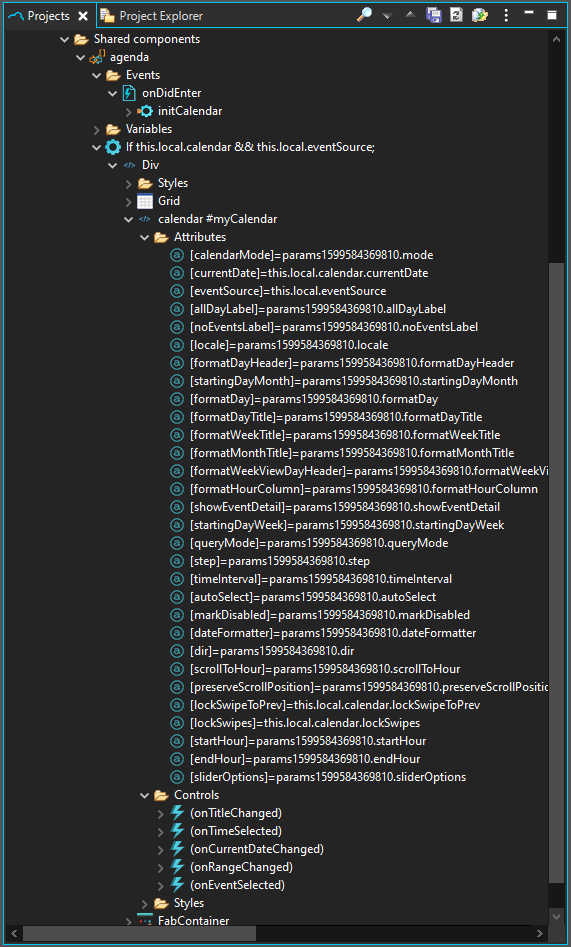

# lib_ExtendedComponents

Set of shared components you can use in your projects:
    
    - agGrid : Display & Edit tabular data
    - ngxTagInput : Display / remove Chips tags in input fields
    - ionic2-calendar : Ionic calendar directive

SharedComponent can be dropped (CTRL + mouse click) in Mobile Builder page components to make use of it.

## agGrid

The **agGrid** SharedComponent is based on **ag-grid-community** and **ag-grid-angular** NPM packages.\
Visit [Angular Grid](https://www.ag-grid.com/angular-grid/) for documentation and usage.\
See it in action in **testAgGrid1** and **testAgGrid2** Mobile Builder pages.

## ngxTagInput

The **ngxTagInput** SharedComponent is based on **ngx-chips** NPM package.\
Visit [Tag Input Component](https://github.com/Gbuomprisco/ngx-chips/#readme) for documentation and usage.\
See it in action in **testNgxInput** and **testNgxInput1** Mobile Builder pages.

## ionic2-calendar

Shared Component based on https://github.com/twinssbc/Ionic2-Calendar#readme 

