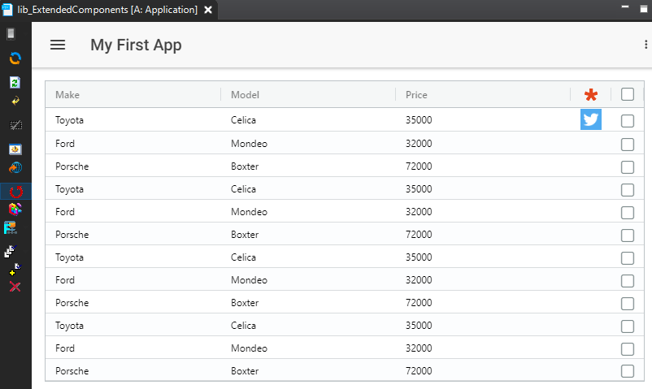
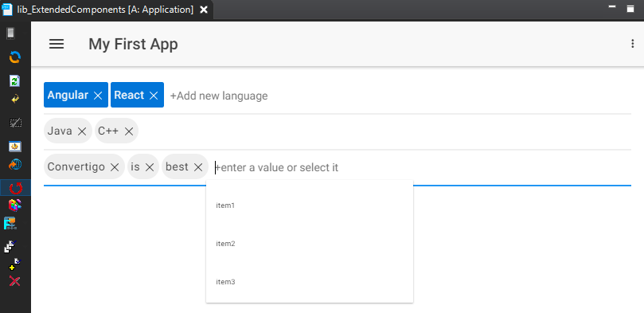

# lib_ExtendedComponents

Set of shared components you can use in your projects:
    
    - agGrid : Display & Edit tabular data
    - ngxTagInput : Display / remove Chips tags in input fields
    - CardIO : Cordova plugin to scan Credit Card
    - ZXing : Library to scan barcodes

SharedComponent can be dropped (CTRL + mouse drag) in Mobile Builder page components to make use of it.

## agGrid

The **agGrid** SharedComponent is based on **ag-grid-community** and **ag-grid-angular** NPM packages.\
Visit [Angular Grid](https://www.ag-grid.com/angular-grid/) for documentation and usage.\
See it in action in **testAgGrid1** and **testAgGrid2** Mobile Builder pages.

## ngxTagInput

The **ngxTagInput** SharedComponent is based on **ngx-chips** NPM package.\
Visit [Tag Input Component](https://github.com/Gbuomprisco/ngx-chips/#readme) for documentation and usage.\
See it in action in **testNgxInput** and **testNgxInput1** Mobile Builder pages.

## CardIO

This Cordova plug-in exposes card&#46;io credit card scanning.

The Mobile Builder **CardIO** page demonstrates the use of the plugin.

**cardIO_sc**: SharedComponent component for sample UI.

**cardIO_sa**: SharedAction component to launch credit card recognition process.

 - **Variables**
   - **ccn**: Input tag identifier to set Card Number value to. Optional
   - **cvv**: Input tag identifier to set cryptogram value (123) to. Optional
   - **cexp**: Input tag identifier to set Expiry date value (MM/YY) to. Optional
   - **options**: CardIO plugin options. See https://github.com/card-io/card.io-Cordova-Plugin
   - **local_ccard_suffix**: Suffix for local page variable in case of multiple CardIO plugin instances. Default: ''. Optional
   - **ccard_topic**: Publish Topic name to use with a Subscribe component. Optional

 - **Outputs**

      Result of the scan are of the following:
    - `parent.out` directly under the **invoke cardIO_sa**
    - **PublishEvent** to a topic if one was provided and a Subscribe component added.
    - `ccard_result` local page variable eventually suffixed by **local_ccard_suffix**

## ZXing

ZXing ("zebra crossing") is an open-source, multi-format 1D/2D barcode image processing library implemented in Java, with ports to other languages.

The Mobile Builder **ZXing** page demonstrates the use of this library.

**ZXing_sa**: SharedAction component to launch barcode recognition process.

 - **Variables**
   - **type**: Scan from 'file' or 'video'. Default: 'file'
   - **imgId**: Img tag identifier to output image file. Optional
   - **videoId**: Video tag identifier to output video camera. Default: 'video'. Optional
   - **resultId**: Input tag identifier to set value to. Optional
   - **topic**: Publish Topic name to use with a Subscribe component. Optional
   - **isOuputEvent**: Publish scan result or not to the topic event. Default: true.
   - **isOuputLocal**: Insert or not the scan result in a local page variable. The variable is composed of 'zxing:' + topic + ref variables. Default: true.
   - **ref**: In case of multiple ZXing package instances, set the variable to different values to distinguish the Publish data event and/or the local page variable. Default: ''. Optional

 - **Outputs**

      Result of the scan are of the following:
    - `parent.out` directly under the **invoke ZXing_sa**
    - **PublishEvent** to a topic if one was provided and if **isOuputEvent** is set to *true*.
    - `page.local["zxing:<topic><ref>"]` local page variable if **isOuputLocal** is set to *true*.